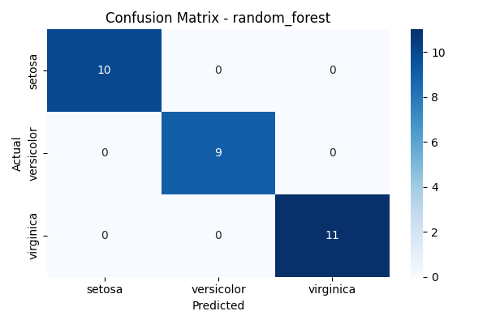

# 🌸 Iris Flower Classifier  


[](https://www.python.org/)  
[](https://scikit-learn.org/)  
[](https://jupyter.org/)  
[](LICENSE)  

A simple **machine learning project** that classifies iris flowers into three species (*setosa, versicolor, virginica*) based on their sepal and petal dimensions.  

This project showcases:
- Data exploration and visualization  
- Training classical ML algorithms (Logistic Regression, Decision Tree, Random Forest, SVM)  
- Evaluation with metrics and confusion matrix  
- Clean and reproducible code + notebook walkthrough  

---

## 📂 Repository Structure

```
iris-flower-classifier/
│── README.md
│── requirements.txt
│── notebooks/
│ └── iris_exploration.ipynb <- Jupyter notebook with EDA + models
│── src/
│ ├── data.py <- Load & preprocess dataset
│ ├── model.py <- Training + evaluation functions
│ ├── utils.py <- Helper functions (metrics, plots)
│ └── train.py <- Run training pipeline
│── results/
│ ├── confusion_matrix.png
│ └── metrics.json
│── tests/
│ └── test_data.py <- Example test (dataset shape, etc.)
└── .gitignore
```

---

## ⚙️ Installation  

Clone the repository:  
```bash
git clone https://github.com/JosephS96/iris-flower-classification.git
cd iris-flower-classifier
```

Create and activate a virtual environment (optional but recommended):

```bash
python -m venv venv
source venv/bin/activate   # On Linux/Mac
venv\Scripts\activate      # On Windows
```

Install dependencies:
```bash
pip install -r requirements.txt
```

## 🚀 Usage

1. Run the notebook (exploration + results)
```bash
jupyter notebook notebooks/iris_exploration.ipynb
```
2. Run the training script
```bash
python src/train.py --model random_forest
```
Other options: `logistic_regression`, `decision_tree`, `svm`, `dummy`

Example:
```bash
python src/train.py --model svm
```
This will output metrics and save results (confusion matrix, accuracy) under /results/.

## 📊 Results
**Best Model**: Random Forest Classifier, Logistic Regression, Decision Tree and SVM

**Accuracy**: ~97% on all classifiers except the Dummy Classifier

📌 Example confusion matrix:




## ✅ Tests
Run simple unit tests to validate dataset loading & preprocessing:
```bash
pytest tests/
```

## 📈 Future Improvements
- Add hyperparameter tuning with GridSearchCV
- Deploy as a simple Flask/Streamlit web app for interactive predictions
- Convert pipeline into a scikit-learn Pipeline object for reusability